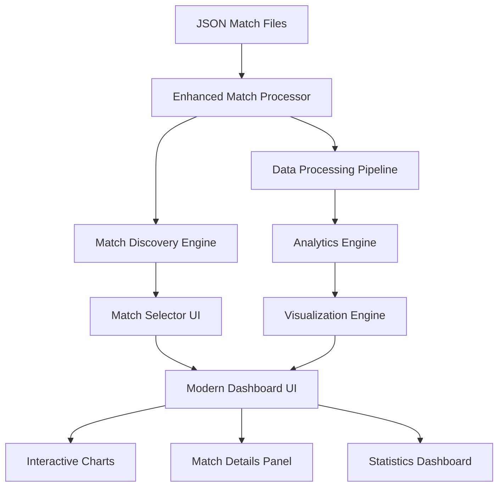

# Cricket Dashboard Enhancement Design Document

## Overview

This design document outlines the architecture and implementation approach for transforming the existing cricket dashboard into a modern, sleek, and comprehensive cricket analytics platform. The enhanced dashboard will process all JSON match data, provide intelligent match selection, deliver engaging visualizations, and offer an exceptional user experience that cricket fans will love.

## Architecture

### High-Level Architecture



### Component Architecture

The system follows a modular architecture with clear separation of concerns:

1. **Data Layer**: JSON file processing and caching
2. **Processing Layer**: Match discovery, data transformation, and analytics
3. **Business Logic Layer**: Match selection, filtering, and statistical calculations
4. **Presentation Layer**: Modern UI components and interactive visualizations
5. **User Interface Layer**: Streamlit-based dashboard with enhanced UX

## Components and Interfaces

### Enhanced Match Processor

**Purpose**: Intelligently discover, process, and cache cricket match data from JSON files.

**Key Methods**:
- `discover_all_matches()`: Scans src/data folder and extracts match metadata
- `process_match_data(match_file)`: Converts JSON to dashboard format
- `extract_match_info(json_data)`: Extracts teams, venue, date, significance
- `cache_match_data(match_id, data)`: Implements intelligent caching
- `get_cached_match(match_id)`: Retrieves cached match data

**Interface**:
```python
class EnhancedMatchProcessor:
    def discover_all_matches(self) -> Dict[str, MatchInfo]
    def process_match_data(self, match_file: str) -> pd.DataFrame
    def extract_match_info(self, json_data: dict) -> MatchInfo
    def get_match_statistics(self, match_data: pd.DataFrame) -> MatchStats
```

### Match Discovery Engine

**Purpose**: Intelligently categorize and organize available cricket matches.

**Key Features**:
- Automatic team name extraction and standardization
- Match significance detection (Finals, World Cup, Series)
- Venue and date parsing with validation
- Match type classification (T20, ODI, Test)
- Outcome and result extraction

**Interface**:
```python
class MatchDiscoveryEngine:
    def scan_match_files(self) -> List[str]
    def extract_match_metadata(self, file_path: str) -> MatchMetadata
    def categorize_matches(self, matches: List[MatchMetadata]) -> Dict[str, List[MatchMetadata]]
    def generate_match_display_name(self, metadata: MatchMetadata) -> str
```

### Analytics Engine

**Purpose**: Calculate comprehensive match statistics and performance metrics.

**Key Calculations**:
- Ball-by-ball progression analysis
- Wicket impact assessment with detailed commentary
- Batting and bowling performance metrics
- Partnership analysis and momentum tracking
- Match situation analysis (required run rate, pressure moments)

**Interface**:
```python
class AnalyticsEngine:
    def calculate_match_progression(self, match_data: pd.DataFrame) -> ProgressionData
    def analyze_wicket_impacts(self, match_data: pd.DataFrame) -> List[WicketImpact]
    def compute_performance_metrics(self, match_data: pd.DataFrame) -> PerformanceMetrics
    def identify_key_moments(self, match_data: pd.DataFrame) -> List[KeyMoment]
```

### Visualization Engine

**Purpose**: Create modern, interactive charts and visualizations.

**Chart Types**:
- Match progression timeline with wicket markers
- Run rate analysis with momentum indicators
- Wicket impact visualization with commentary
- Performance comparison charts
- Interactive match explorer with filtering

**Interface**:
```python
class VisualizationEngine:
    def create_match_timeline(self, data: pd.DataFrame) -> plotly.Figure
    def create_wicket_impact_chart(self, wickets: List[WicketImpact]) -> plotly.Figure
    def create_performance_dashboard(self, metrics: PerformanceMetrics) -> plotly.Figure
    def create_interactive_explorer(self, data: pd.DataFrame) -> plotly.Figure
```

### Modern Dashboard UI

**Purpose**: Provide a sleek, responsive, and engaging user interface.

**Key Components**:
- Cricket-themed header with animations
- Intelligent match selector with search and filtering
- Interactive statistics cards with hover effects
- Tabbed chart interface with smooth transitions
- Responsive layout for different screen sizes

## Data Models

### MatchInfo
```python
@dataclass
class MatchInfo:
    match_id: str
    teams: List[str]
    venue: str
    date: str
    match_type: str
    event_name: str
    significance: str  # "Final", "World Cup", "Regular"
    outcome: Dict[str, Any]
    file_path: str
```

### MatchStats
```python
@dataclass
class MatchStats:
    total_balls: int
    total_wickets: int
    total_runs: int
    match_duration_minutes: float
    innings_count: int
    highest_partnership: int
    best_bowling_figures: str
    match_winner: str
```

### WicketImpact
```python
@dataclass
class WicketImpact:
    wicket_number: int
    over: int
    ball: int
    batsman_out: str
    dismissal_type: str
    commentary: str
    match_situation: str
    impact_score: float  # 1-10 scale
```

### PerformanceMetrics
```python
@dataclass
class PerformanceMetrics:
    batting_strike_rates: Dict[str, float]
    bowling_economy_rates: Dict[str, float]
    partnership_details: List[Partnership]
    momentum_changes: List[MomentumChange]
    pressure_moments: List[PressureMoment]
```

## Correctness Properties

*A property is a characteristic or behavior that should hold true across all valid executions of a system-essentially, a formal statement about what the system should do. Properties serve as the bridge between human-readable specifications and machine-verifiable correctness guarantees.*

### Property 1: Match Discovery Completeness
*For any* valid JSON cricket match file in the src/data folder, the Match Discovery Engine should successfully extract match metadata and make it available for selection
**Validates: Requirements 1.1, 1.2**

### Property 2: Data Processing Consistency
*For any* selected cricket match, processing the same match multiple times should produce identical statistical results and visualizations
**Validates: Requirements 1.4, 7.2**

### Property 3: UI Responsiveness
*For any* user interaction with dashboard elements, the interface should provide immediate visual feedback and complete the action within acceptable time limits
**Validates: Requirements 3.2, 3.5**

### Property 4: Match Information Accuracy
*For any* processed cricket match, all displayed match details (teams, venue, date, statistics) should accurately reflect the source JSON data
**Validates: Requirements 2.1, 2.3, 2.4**

### Property 5: Visualization Data Integrity
*For any* generated chart or graph, the displayed data points should correctly correspond to the underlying match data without loss or corruption
**Validates: Requirements 5.1, 5.2, 5.5**

### Property 6: Caching Consistency
*For any* cached match data, retrieving the cached version should produce identical results to reprocessing the original JSON file
**Validates: Requirements 7.1, 7.5**

### Property 7: Search and Filter Accuracy
*For any* applied search criteria or filter, the returned match results should contain only matches that satisfy all specified conditions
**Validates: Requirements 8.1, 8.2, 8.3**

### Property 8: Code Cleanup Safety
*For any* removed code file during cleanup, the remaining codebase should maintain all existing functionality without introducing errors
**Validates: Requirements 4.3, 4.4**

## Error Handling

### File Processing Errors
- **Invalid JSON Format**: Skip malformed files with user notification
- **Missing Required Fields**: Use default values and log warnings
- **File Access Errors**: Graceful degradation with error messages

### Data Processing Errors
- **Empty Match Data**: Display appropriate user messages
- **Calculation Errors**: Use fallback values and error indicators
- **Memory Issues**: Implement data pagination and cleanup

### UI Error Handling
- **Chart Rendering Failures**: Show placeholder charts with error messages
- **Network Issues**: Implement retry mechanisms with user feedback
- **Browser Compatibility**: Provide fallback UI components

## Testing Strategy

### Unit Testing Approach
- **Match Processing Tests**: Verify JSON parsing and data extraction accuracy
- **Analytics Calculation Tests**: Validate statistical computations and edge cases
- **UI Component Tests**: Test individual dashboard components and interactions
- **Caching Mechanism Tests**: Verify cache consistency and invalidation logic

### Property-Based Testing Approach
Using **Hypothesis** as the property-based testing library, with each test configured to run a minimum of 100 iterations:

- **Property Test 1**: Match Discovery Completeness
  - Generate random valid JSON cricket files
  - Verify all files are discovered and processed correctly
  - **Feature: cricket-dashboard-enhancement, Property 1: Match Discovery Completeness**

- **Property Test 2**: Data Processing Consistency  
  - Generate random match selections
  - Verify identical results across multiple processing runs
  - **Feature: cricket-dashboard-enhancement, Property 2: Data Processing Consistency**

- **Property Test 3**: UI Responsiveness
  - Generate random user interactions
  - Verify response times and visual feedback
  - **Feature: cricket-dashboard-enhancement, Property 3: UI Responsiveness**

- **Property Test 4**: Match Information Accuracy
  - Generate random JSON match data
  - Verify displayed information matches source data
  - **Feature: cricket-dashboard-enhancement, Property 4: Match Information Accuracy**

- **Property Test 5**: Visualization Data Integrity
  - Generate random match datasets
  - Verify chart data points match underlying data
  - **Feature: cricket-dashboard-enhancement, Property 5: Visualization Data Integrity**

- **Property Test 6**: Caching Consistency
  - Generate random cache operations
  - Verify cached data matches original processing results
  - **Feature: cricket-dashboard-enhancement, Property 6: Caching Consistency**

- **Property Test 7**: Search and Filter Accuracy
  - Generate random search criteria and match datasets
  - Verify filtered results contain only matching items
  - **Feature: cricket-dashboard-enhancement, Property 7: Search and Filter Accuracy**

- **Property Test 8**: Code Cleanup Safety
  - Generate random file removal scenarios
  - Verify functionality preservation after cleanup
  - **Feature: cricket-dashboard-enhancement, Property 8: Code Cleanup Safety**

### Integration Testing
- **End-to-End Workflow Tests**: Complete user journeys from match selection to analysis
- **Performance Tests**: Load testing with large numbers of JSON files
- **Cross-Browser Tests**: UI compatibility across different browsers
- **Data Pipeline Tests**: Complete data flow from JSON files to visualizations

Both unit tests and property tests are complementary and essential: unit tests verify specific examples and edge cases, while property tests verify universal properties across all inputs, providing comprehensive coverage for cricket dashboard correctness.